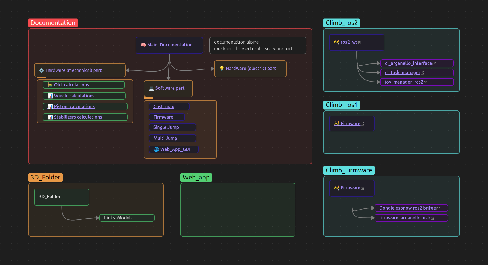

## Hi there 👋

Welcome to the GitHub organization of **MalaHard-RoboTech**, where we develop innovative robotic solutions for extreme environments.

---

### 🧗‍♂️ Project ALPINE
**ALPINE** is a climbing robot designed for operations in mountain environments.  
Mountain slopes represent harsh terrains where humans are often required to perform dangerous tasks like removing unstable boulders, cutting hazardous vegetation, or deploying safety nets. ALPINE aims to replace human intervention with a robot capable of:

- Navigating steep and irregular terrain  
- Carrying heavy payloads  
- Performing complex tasks  
- Overcoming natural barriers by jumping using a retractable leg while suspended on ropes  

🔗 [Research paper of Focchi](https://arxiv.org/pdf/2403.15142)  
🔗 [Repository of Focchi](https://github.com/mfocchi/climbing_robots2)

---

### 📁 Our Repositories

- 🔧 [Documentation_Climb](https://github.com/MalaHard-RoboTech/Documentation_Climb) — Docs, designs, and references  
- 🧠 [Climb_ros2_ws](https://github.com/MalaHard-RoboTech/Climb_ros2) — ROS 2 workspace for simulation and control  
- 🔌 [Climb_arduino](https://github.com/MalaHard-RoboTech/Climb_arduino) — Microcontroller-level experiments  
- 📊 [Matlab_Scirpts](https://github.com/MalaHard-RoboTech/Matlab_Scirpts) — Data analysis and control simulations  
- 🤖 [Alpine_Climbing_robots](https://github.com/MalaHard-RoboTech/Alpine_Climbing_robots) — Main repo for the climbing robot
---
for electric schematic see the following link: [clik_here](https://app.diagrams.net/?state=%7B%22ids%22:%5B%221SWlFUtQWcLqqYK_TRkSc6NhGTX1uZMFa%22%5D,%22action%22:%22open%22,%22userId%22:%22115687910348338726937%22,%22resourceKeys%22:%7B%7D%7D)

  

---
